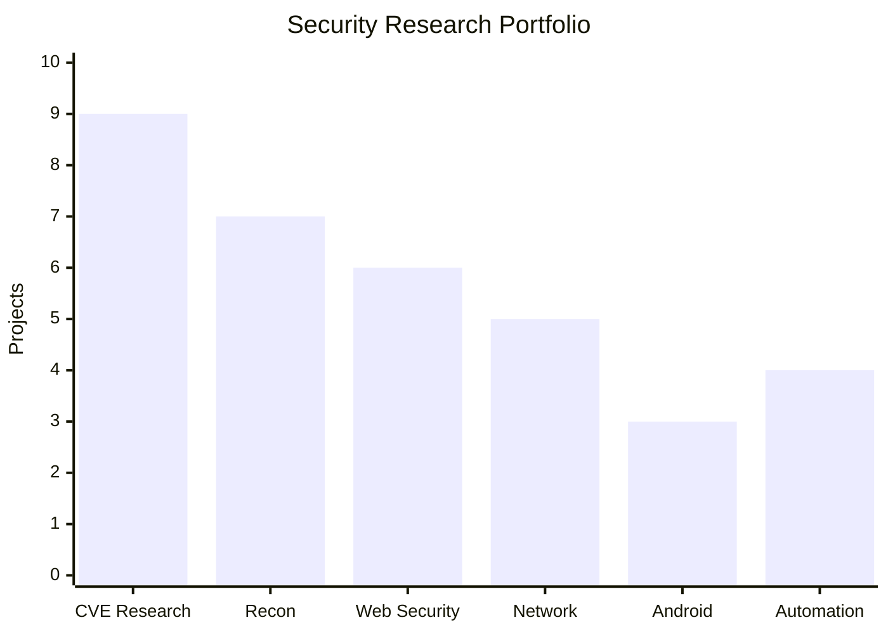

<div align="center">
  
</div><p align="center">
  
</p><p align="center">
  
  
  
  
</p>

---

# K3ysTr0K3R

<p align="center">
  
</p>

<p align="center">
  <b>Security Researcher • Ethical Hacker • Exploit Developer</b>
</p>

<p align="center">
  <i>Research. Build. Break. Understand.</i>
</p>

<p align="center">
  
  
  
</p>

---

## Highlights

<table>
<tr>
<td width="50%">

### Vulnerability Research

A growing collection of vulnerability research and proof-of-concept implementations covering publicly disclosed CVEs.

</td>

<td width="50%">

### Security Tooling

Reconnaissance scanners, vulnerability scanners, protocol tooling, automation utilities, and security research tools.

</td>
</tr>

<tr>
<td width="50%">

### Exploit Development

PoCs covering RCE, authentication bypass, information disclosure, user enumeration, and other vulnerability classes.

</td>

<td width="50%">

### Open Source

Security research and tooling made available for researchers, defenders, and authorized security testing.

</td>
</tr>
</table>

---

# Tools & Projects

A collection of security tools and research projects I've built.

### DroidSniper

**Misconfigured Android Debug Bridge Scanner**

Detects exposed or improperly configured Android Debug Bridge services so they can be identified and secured.

[View DroidSniper →](https://github.com/K3ysTr0K3R/DroidSniper)

---

### Security Scanners

Research tooling covering areas such as:

```text
HTTP
├── HTTP reconnaissance
├── RCE detection
├── SQL injection testing
└── Web application enumeration

Network
├── Service enumeration
├── Protocol discovery
├── RTSP research
├── Apache/WebDAV enumeration
└── Network reconnaissance

Android
└── ADB security scanning
```

---

### CVE Exploit Collection

A large collection of publicly disclosed vulnerability PoCs covering multiple generations of security research.

```text
2008 ── CVE-2008-5862
2010 ── CVE-2010-4231
2014 ── CVE-2014-6271
2015 ── CVE-2015-2166
2017 ── CVE-2017-5487
        CVE-2017-7921
        CVE-2017-8225
2018 ── CVE-2018-14847
        CVE-2018-9995
2019 ── CVE-2019-15107
        CVE-2019-17382
2021 ── CVE-2021-22873
        CVE-2021-34621
        CVE-2021-4191
        CVE-2021-42013
        CVE-2021-43798
2022 ── CVE-2022-0165
        CVE-2022-33891
        CVE-2022-34753
2023 ── CVE-2023-23752
        CVE-2023-32315
        CVE-2023-43208
        CVE-2023-51467
2024 ── CVE-2024-10914
        CVE-2024-25600
        CVE-2024-27198
        CVE-2024-3273
        CVE-2024-4577
```

---

# Research Portfolio

| Area                   | Research                                     |
| ---------------------- | -------------------------------------------- |
| Vulnerability Research | CVE analysis and reproduction                |
| Exploit Development    | Educational proof-of-concept development     |
| Web Security           | HTTP, RCE, SQLi and application security     |
| Network Security       | Service and protocol reconnaissance          |
| Android Security       | ADB exposure and configuration analysis      |
| Automation             | Security research and reconnaissance tooling |

---

# Research by Category



> Categories represent the areas reflected throughout the projects and research collection.

---

# Technology

<p align="center">
  
</p>

```text
Python
Go
Bash
Linux
Git
GitHub
Docker
```

---

# Published Exploits

### Selected Research

* **CVE-2019-15107** — Webmin Remote Code Execution
* **CVE-2021-42013** — Apache HTTP Server Remote Code Execution
* **CVE-2018-9995** — DVR Authentication Bypass
* **CVE-2018-14847** — MikroTik RouterOS vulnerability
* **CVE-2017-8225** — GoAhead System.ini information disclosure
* **CVE-2017-5487** — WordPress user enumeration
* **CVE-2021-4191** — GitLab user enumeration
* **CVE-2017-7921** — Hikvision vulnerability

[Explore the full exploit collection →](https://github.com/K3ysTr0K3R?tab=repositories)

---

# GitHub Activity

<p align="center">
  
</p>

---

# Contributions

<p align="center">
  
</p>

---

# GitHub Statistics

<p align="center">
  
  
</p>

---

# Collaboration

Interested in:

```text
Security Research
Open Source
Vulnerability Research
Exploit Development
Security Tooling
Interesting Technical Problems
```

If you're building something interesting, I'm always open to collaboration.

---

# Disclaimer

All security tools and proof-of-concept exploits in my repositories are provided for **educational, research, and authorized security testing purposes**.

Only use these tools against systems you own or have explicit permission to test.

I do not take responsibility for misuse or unauthorized activity.

---

<p align="center">

<i>"Every vulnerability tells a story. Understand it."</i>

</p>

<p align="center">
  <sub>K3ysTr0K3R • Security Research • Open Source</sub>
</p>
